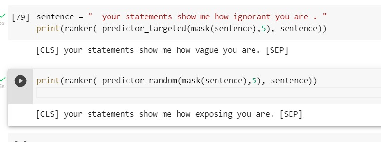

# Detoxifier

Through this project we develop a pipeline to detoxify an input sentence without the usage of parallel detoxified data to train our model. 

We identify the toxic word, mask it and run our fine tuned BERT to generate the most appropriate non toxic word as a replacement. 

## Approach Used

### Identification of toxic word
- To mask the toxic word we use the following approaches
    - Bag of words: we simply mask the words present in a pre-existing list of toxic and non toxic words. We obtained this list by running `NgramSalienceCalculator` on the previous lists. (code present [here](./scripts/Detox.ipynb))
    - Linear Regression: A  coefficient is generated for each word by fitting the data linearly onto the toxic and non toxic corpus.
    - Using `Roberta`, a toxic sentence classifier. For a toxic sentence of n words, we create n variations of the sentence by masking a different word in each variant. If the sentence is below a toxic threshold, we return this sentence. Else, we further mask another token in this sentence. This process is done until the sentence is below the threshold. 

### Generating Alternatives 
- To generate substitutes for the masked tokens we use the BERT model trained on Masked Language Model. 

#### Fine Tuning BERT

- A list of masked positive and negative sentences is used to fine tune this model. To train, we pass the masked positive sentences with flag 0 and negative with flag 1 into the model, with target being the masked token. 

- While generating the actual tokens for our specific task, we always pass the flag 0 as we want the output to be non toxic.

- We use the following approaches to MASK tokens for fine tuning:
    - Random Approach: one word at random is masked in the sentence. This approach was suggested by the paper [`Conditional BERT Contextual Augmentation`](https://arxiv.org/abs/1812.06705). 
    - Targetted approach: mask the words present in a pre-existing list of toxic and non toxic words.

### Choosing the correct alternative

- Now, this fine tuned BERT will give us 10 possible alternatives to the originally masked token.
- We will evaluate the alternatives by using the product of similarity with respect to the original masked token with the fluency and non-toxicity.
- Similarity will be determined by using cosine similarity, fluency by [`GPT2LMHeadModel`](https://huggingface.co/docs/transformers/model_doc/gpt2) and non-toxicity using [`Roberta`](https://huggingface.co/SkolkovoInstitute/roberta_toxicity_classifier)

- We also provide multi token alternatives by replacing the single masks with a double masks, and then comparing the output with that obtained from a single mask. An example is as follows:

## Repository Structure

 * [scripts](./scripts)
   * [baseline.ipynb](./scripts/baseline.ipynb)
   * [fine_tune_bert.ipynb](./scripts/fine_tune_bert.ipynb)
   * [detox.ipynb](./scripts/detox.ipynb)
 * [data](./data)
   * [jigsaw](./data/jigsaw/)
        * [train.csv](./data/jigsaw/train.csv)
        * [test.csv](./data/jigsaw/test.csv)
        * [test_labels.csv](./data/jigsaw/test_labels.csv)
   * [train](./data/train/)
        * [train_normal](./data/train/train_normal)
        * [train_toxic](./data/train/train_toxic)
   * [vocab](./data/vocab/)
        * [negative_words](./data/vocab/negative_words.txt)
        * [positive_words](./data/vocab/positive_words.txt)

The script folder contains the notebooks for baseline models, fine tuning BERT and the final detoxifying pipeline. 

The data folder contains the 
- jigsaw dataset: can be downloaded from [here](https://www.kaggle.com/c/jigsaw-toxic-comment-classification-challenge). This data is used to calculate the accuracy of our model.
- training data: list of positive and negative sentences that is used to fine tune BERT
- vocab: list of positive and negative words obtained

## How to run?

- `pip install -r requirements.txt` to install the required dependencies.
- To detoxify a given sentence, refer [this](./scripts/detox.ipynb)

Further,
-  To fine tune the BERT Model, refer [this](./scripts/fine_tune_bert.ipynb)http://moss.stanford.edu/results/5/6862770529437
- To run the baseline model, refer [this](./scripts/baseline.ipynb)

## Models

The fine tuned BERT models can be found [here](https://iiitaphyd-my.sharepoint.com/:f:/g/personal/eshika_k_research_iiit_ac_in/EiGJLE_32NVEqzGDiNUx6WgBP6ZGWgYDQjcd6CvvOBBPJw?e=caBKUH)

## Qualitative Analysis

Some examples of the output obtained:

## Observation
The targetted fine tuned model showcased better results as compared to the random fine tuned model suggested by the paper [`Conditional BERT Contextual Augmentation`](https://arxiv.org/abs/1812.06705). 

For example,

## Results

The metric used to evaluate our model was (similarity*fluency)/(perplexities).
The scores obtained were as follows:

- Baseline Model (T5 Paraphraser): 4.370629371e-3
- Random-masked BERT: 1.419647927e-2
- Target-masked BERT: 1.744591766e-2
